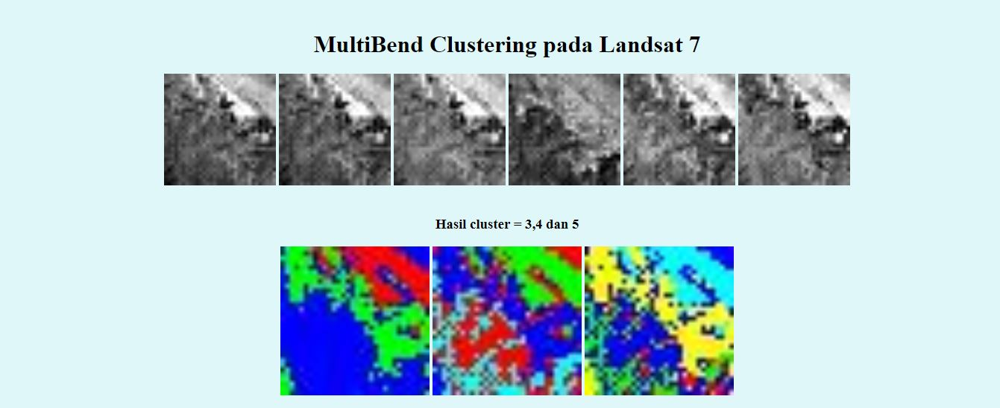

# **Multibend-clustering pada gambar dari satelit landsat**

Algoritma clustering yang digunakan adalah hirearical clustering
Tulisan saya untuk multibend-clustering:
https://medium.com/@ranggaantok/menggunakan-clustering-untuk-menggali-informasi-dari-citra-satelit-d5eebd7160bd

